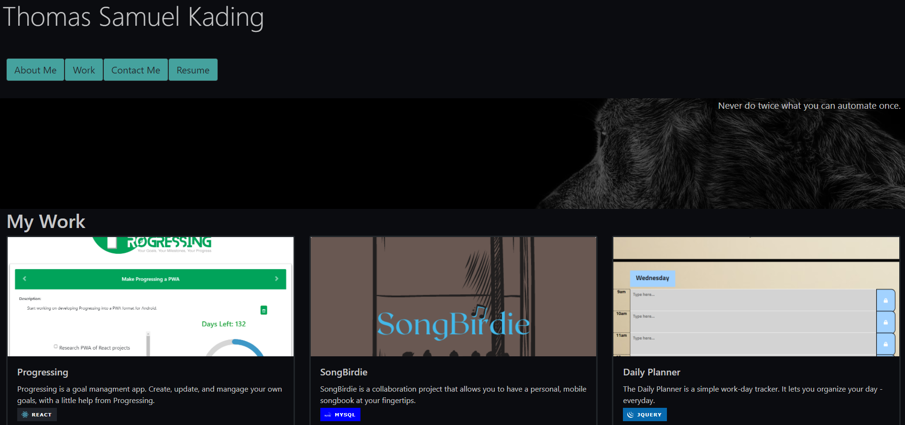
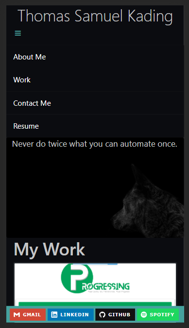

# Portfolio
Welcome to my Portfolio Repository!  I have recently updated my portfolio from a [javascript/css web page](https://github.com/Tskading/Portfolio) to a React based site.  The flexibility of React made this a fun and exciting update to make, and allowed for me to refocus my efforts on styling and smoother information display.  This application will guide you through some of my most proud projects, and allow you to see the whole of my coding work throughout the past year.  You can also grab a copy of my resume, shoot me an email, or see what music I have been coding to in Spotify!

## Quick Notes

My Portfolio's default home page is the About Me information - on desktop you will see four buttons to help navigate to the appropriate information, on mobile you will see a hamburger menu that will allow you to navigate appropriately.  All of the information on the Contact Me page is also available in my footer - so you are always close to reaching out.  My work page displays my six most proud projects - three of which are great group projects of which I am very proud of my contributions.  You can check out more of my projects from my repository on Github.  My resume is also available for download as well.

## Links and Screenshots

